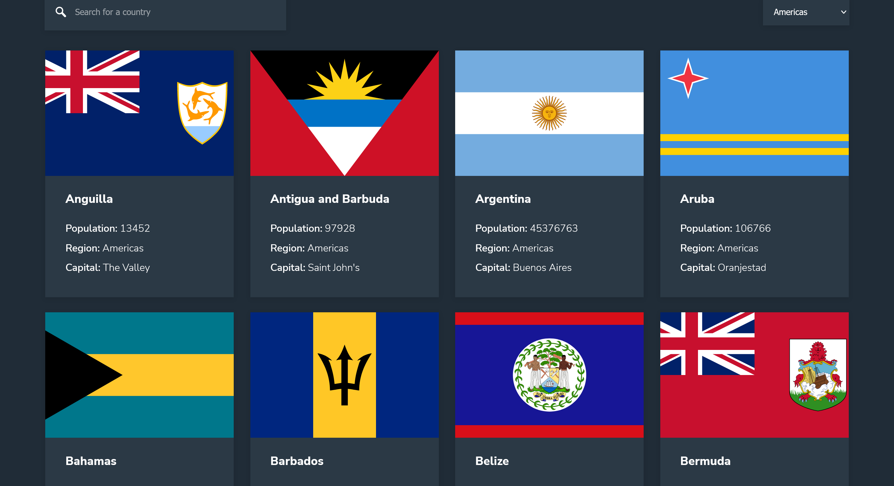
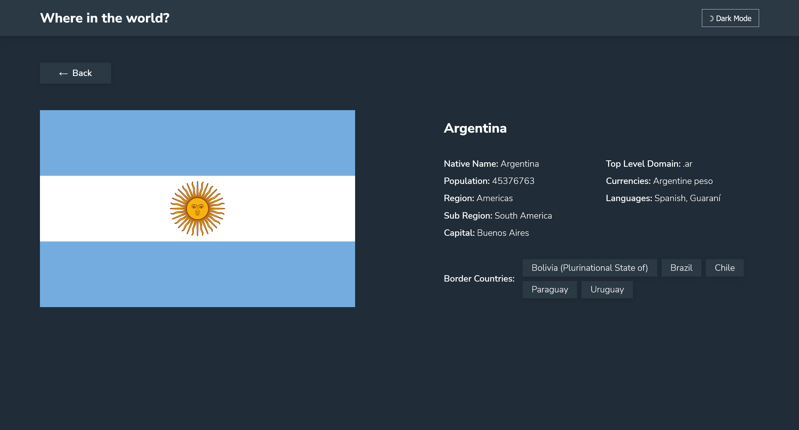
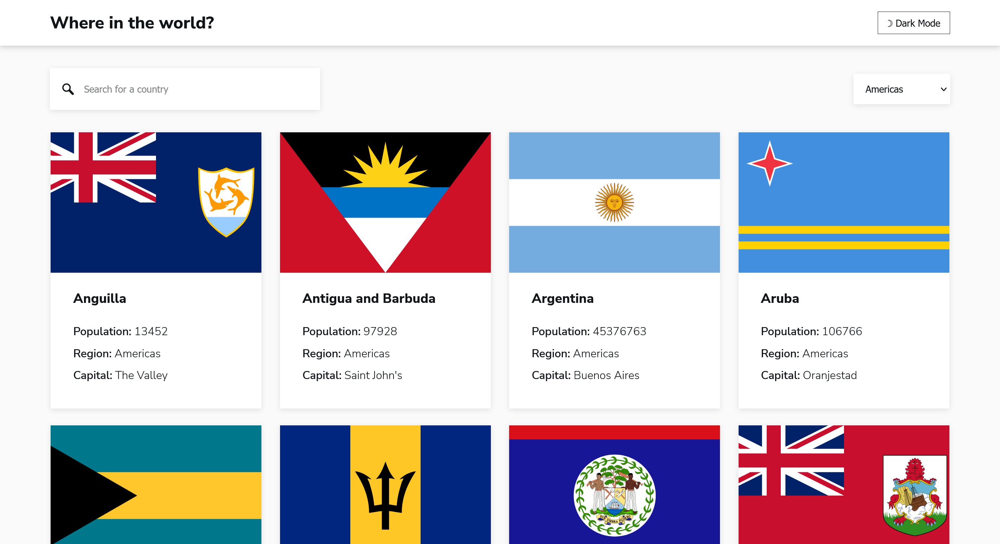
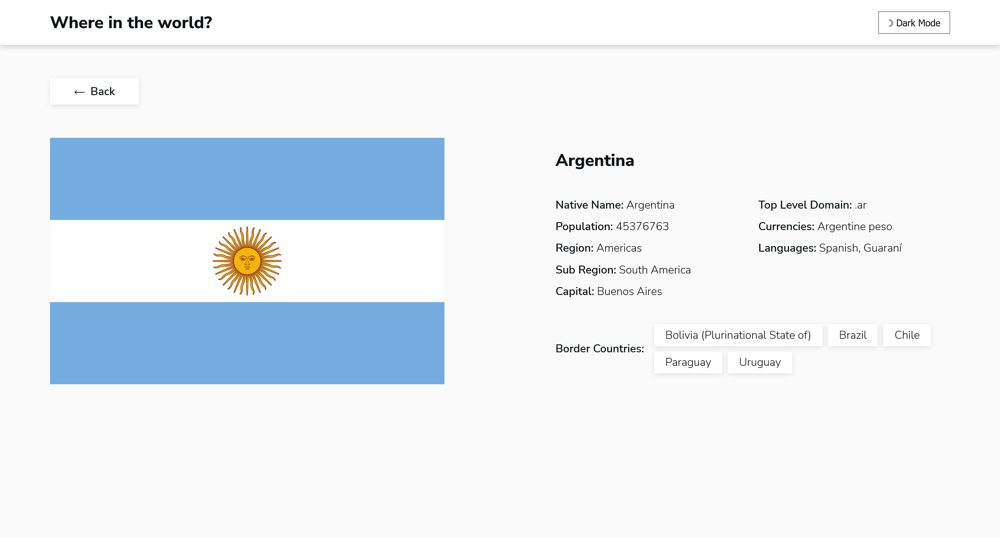

# Frontend Mentor - REST Countries API with color theme switcher solution

This is a solution to the [REST Countries API with color theme switcher challenge on Frontend Mentor](https://www.frontendmentor.io/challenges/rest-countries-api-with-color-theme-switcher-5cacc469fec04111f7b848ca). Frontend Mentor challenges help you improve your coding skills by building realistic projects.

### [Visit the live page]()
#### [The page is mobile-friendly]()

## Overview

### The challenge

Users should be able to:

- See all countries from the API on the homepage
- Search for a country using an `input` field
- Filter countries by region
- Click on a country to see more detailed information on a separate page
- Click through to the border countries on the detail page
- Toggle the color scheme between light and dark mode *(optional)*

## My process

### Built with

- [React](https://reactjs.org/) - JS library
- [Styled Components](https://styled-components.com/) - For styles
- [React Router](https://reactrouter.com/) - For alternating between pages
- Flexbox
- CSS Grid

### What I learned

I learned how to fetch data from an external API and convert it into a Javascript object, learned how to do dark/light mode, and learned how to wait for the data to be fetched before rendering anything.

### Useful resources

- [React Router's Quick Start](https://reactrouter.com/web/guides/quick-start) - A really good resource if you want to just use the library without going too deep.

## Author

- Frontend Mentor - [@calvindalenta](https://www.frontendmentor.io/profile/calvindalenta)
- LinkedIn - [@calvindalenta](https://www.linkedin.com/in/calvindalenta/)

### Screenshot

